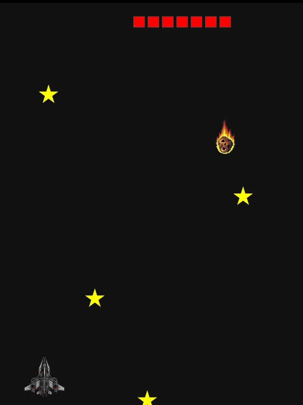

# 🚀 Piloto Estelar

Um jogo simples desenvolvido com HTML, CSS e JavaScript, onde o jogador controla uma nave e precisa coletar estrelas enquanto evita meteoros.

## 🎮 Funcionalidades

- Sistema de pontuação
- Níveis progressivos
- Aumento de dificuldade
- Sistema de vidas
- Colisão com meteoros
- Tela de Game Over
- Reinício do jogo

## 🛠 Tecnologias

- HTML5
- CSS3
- JavaScript

## ▶️ Jogar agora

https://lucianojosue.github.io/Piloto-estelar/

## 👨‍💻 Autor

Luciano
